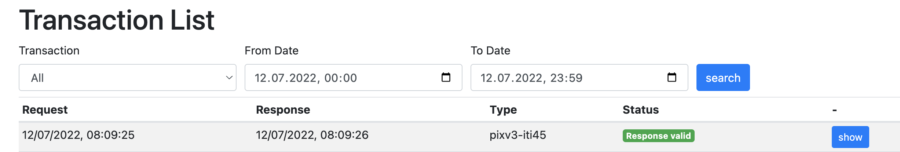

The EPR Integration Kit is available at [https://test.ahdis.ch/eprik-cara/](https://test.ahdis.ch/eprik-cara/).

<figure markdown>
  { width="600" }
  <figcaption>Transaction List</figcaption>
</figure>
By default it lists all transactions made during the day. You can filter by IHE transaction type or time range.

## EPR Endpoints

That the requests are routed through **EPRIK** the following endpoints need to be configured in your primary system
for EPRIK instead of CARA INT for an EPR integration:

| Transaction                                                                                                                                                                                                                                                          | EPRIK                                                                                                                       |
|----------------------------------------------------------------------------------------------------------------------------------------------------------------------------------------------------------------------------------------------------------------------|-----------------------------------------------------------------------------------------------------------------------------|
| Host                                                                                                                                                                                                                                                                 | test.ahdis.ch                                                                                                               |
| Port                                                                                                                                                                                                                                                                 | 443 (https) or 80 (http)                                                                                                    |
| XDS [[ITI-18]](https://profiles.ihe.net/ITI/TF/Volume2/ITI-18.html)                                                                                                                                                                                                  | /eprik-cara/camel/cara/Registry/services/RegistryService                                                                    |
| XDS [[ITI-18]](https://profiles.ihe.net/ITI/TF/Volume2/ITI-18.html) Initiating Gateway                                                                                                                                                                               | /eprik-cara/camel/cara/XCA/services/InitiatingGatewayService                                                                |
| XDS [[ITI-41]](https://profiles.ihe.net/ITI/TF/Volume2/ITI-41.html)                                                                                                                                                                                                  | /eprik-cara/camel/cara/Repository/services/RepositoryService                                                                |
| XDS [[ITI-43]](https://profiles.ihe.net/ITI/TF/Volume2/ITI-43.html)                                                                                                                                                                                                  | /eprik-cara/camel/cara/Repository/services/RepositoryService                                                                |
| XDS [[ITI-43]](https://profiles.ihe.net/ITI/TF/Volume2/ITI-43.html) Initiating Gateway                                                                                                                                                                               | /eprik-cara/camel/XCA/services/InitiatingGatewayService                                                                     |
| XDS MU [[ITI-57]](https://profiles.ihe.net/ITI/TF/Volume2/ITI-57.html)                                                                                                                                                                                               | /eprik-cara/camel/cara/Registry/services/RegistryService                                                                    |
| XDS RMU [[ITI-92]](https://profiles.ihe.net/ITI/TF/Volume2/ITI-92.html)                                                                                                                                                                                              | /eprik-cara/camel/cara/Registry/services/RegistryService                                                                    |
| XDS-I RAD [[ITI-69]](https://www.ihe.net/uploadedFiles/Documents/Radiology/IHE_RAD_TF_Vol2.pdf)                                                                                                                                                                      | /eprik-cara/camel/cara/Repository/services/RepositoryService                                                                |
| PIX V3 [[ITI-44]](https://profiles.ihe.net/ITI/TF/Volume2/ITI-44.html)                                                                                                                                                                                               | /eprik-cara/camel/cara/UPIProxy/services/PIXPDQV3ManagerService                                                             |
| PIX V3 [[ITI-45]](https://profiles.ihe.net/ITI/TF/Volume2/ITI-45.html)                                                                                                                                                                                               | /eprik-cara/camel/cara/UPIProxy/services/PIXPDQV3ManagerService                                                             |
| PDQ V3 [[ITI-47]](https://profiles.ihe.net/ITI/TF/Volume2/ITI-47.html)                                                                                                                                                                                               | /eprik-cara/camel/cara/UPIProxy/services/PIXPDQV3ManagerService                                                             |
| HPD [[ITI-58]](https://profiles.ihe.net/ITI/TF/Volume2/ITI-58.html)                                                                                                                                                                                                  | /eprik-cara/camel/cara/HPD/services/HPDService                                                                              |
| HPD [[ITI-59]](https://profiles.ihe.net/ITI/TF/Volume2/ITI-598.html)                                                                                                                                                                                                 | /eprik-cara/camel/cara/HPD/services/HPDService                                                                              |
| CH:PPQ [[PPQ-1]](https://www.bag.admin.ch/dam/bag/de/dokumente/nat-gesundheitsstrategien/strategie-ehealth/gesetzgebung-elektronisches-patientendossier/gesetze/ergaenzung_2.1_anhang_5_epdv_edi_ausgabe_4.pdf.download.pdf/EPDV-EDI_Anhang_5_E2.1_DE_Ausgabe_4.pdf) | /eprik-cara/camel/cara/HPD/services/PR                                                                                      |
| CH:PPQ [[PPQ-2]](https://www.bag.admin.ch/dam/bag/de/dokumente/nat-gesundheitsstrategien/strategie-ehealth/gesetzgebung-elektronisches-patientendossier/gesetze/ergaenzung_2.1_anhang_5_epdv_edi_ausgabe_4.pdf.download.pdf/EPDV-EDI_Anhang_5_E2.1_DE_Ausgabe_4.pdf) | /eprik-cara/camel/cara/HPD/services/PR                                                                                      |
| XUA [[ITI-40]](https://www.bag.admin.ch/dam/bag/de/dokumente/nat-gesundheitsstrategien/strategie-ehealth/gesetzgebung-elektronisches-patientendossier/gesetze/anhang_5_ergaenzung_1_epdv_edi_ausgabe_4.pdf.download.pdf/EPDV-EDI_Anhang_5_E1_DE_Ausgabe_4.pdf)       | /eprik-cara/camel/cara/STS/services/SecurityTokenService                                                                    |
| TCU SAML2                                                                                                                                                                                                                                                            | /eprik-cara/camel/tcu                                                                                                       |
| ATC [[ITI-81]](https://www.ihe.net/uploadedFiles/Documents/ITI/IHE_ITI_Suppl_RESTful-ATNA.pdf)                                                                                                                                                                       | /eprik-cara/camel/cara/ARR/fhir/AuditEvent                                                                                  |
| ATNA [[ITI-20]](https://profiles.ihe.net/ITI/TF/Volume2/ITI-20.html)                                                                                                                                                                                             | atna.test.ahdis.ch:8080 or :80 (currently 37.156.40.86) unsecured TCP according to [RFC5425](https://www.rfc-editor.org/rfc/rfc5425) |
| SVS [[ITI-48]](https://profiles.ihe.net/ITI/TF/Volume2/ITI-48.html)                                                                                                                                                                                                  | /eprik-cara/camel/cara/ValueSetRepository/services/ValueSetRepositoryService                                                |
| SVS [[ITI-60]](https://profiles.ihe.net/ITI/TF/Volume2/ITI-60.html)                                                                                                                                                                                                  | /eprik-cara/camel/cara/ValueSetRepository/services/ValueSetRepositoryService                                                |

You find an overview of the current relevant specifications and the associated links for the Swiss Electronic Patient
Record EPR
also [here](https://www.e-health-suisse.ch/en/technik-semantik/epr-projectathon/epr-programming-aids/relevant-specifications.html)
and in the [Post E-Health Platform – developer portal](https://developer.post.ch/en/e-health).

## transferts (TRA) Endpoints

That the requests are routed through **EPRIK** the following endpoints need to be configured in your primary system
for EPRIK instead of CARA INT for an transferts integration:

| Transaction                                                                   | EPRIK                                                        |
|-------------------------------------------------------------------------------|--------------------------------------------------------------|
| Host                                                                          | test.ahdis.ch                                                |
| Port                                                                          | 443 (https) or 80 (http)                                     |
| TRA PIX V3 [[ITI-44]](https://profiles.ihe.net/ITI/TF/Volume2/ITI-44.html)    | /eprik-cara/camel/tra/PIXPDQ/services/PIXPDQV3ManagerService |
| TRA PIX V3 [[ITI-45]](https://profiles.ihe.net/ITI/TF/Volume2/ITI-45.html)    | /eprik-cara/camel/tra/PIXPDQ/services/PIXPDQV3ManagerService |
| TRA HPD [[ITI-58]](https://profiles.ihe.net/ITI/TF/Volume2/ITI-58.html)       | /eprik-cara/camel/tra/HPD/services/HPDService/               |
| TRA HPD [[ITI-59]](https://profiles.ihe.net/ITI/TF/Volume2/ITI-598.html)      | /eprik-cara/camel/tra/HPD/services/HPDService/               |
| TRA STS [[ITI-40]](https://profiles.ihe.net/ITI/TF/Volume2/ITI-40.html)       | /eprik-cara/camel/tra/b2bsts/SecurityTokenService/           |
| TRA TCU STS                                                                   | /eprik-cara/camel/tra/2000040030829                          |
| TRA [submitDocuments](transferts/wsdl/SourceAdaptorService.wsdl)*             | /eprik-cara/camel/tra/rcdc/SourceAdaptor/                    |
| TRA [GetDocumentList](transferts/wsdl/RecipientCentricDocumentConsumer.wsdl)* | /eprik-cara/camel/tra/rcdc/Rcdc/                             |
| TRA XDS [[ITI-18]](https://profiles.ihe.net/ITI/TF/Volume2/ITI-18.html)*      | /eprik-cara/camel/tra/Registry/services/RegistryService      |
| TRA XDS [[ITI-41]](https://profiles.ihe.net/ITI/TF/Volume2/ITI-41.html)*      | /eprik-cara/camel/tra/Repository/services/RepositoryService  |

* Webservice call needs STS token

## PMP Endpoints

That the requests are routed through **EPRIK** the following endpoints need to be configured in your primary system
for EPRIK instead of CARA INT for a PMP integration for the following XDS transactions:

| Transaction                                                                                        | EPRIK                                                 |
|----------------------------------------------------------------------------------------------------|-------------------------------------------------------|
| Host                                                                                               | test.ahdis.ch                                         |
| Port                                                                                               | 443 (https) or 80 (http)                              |
| XDS [[ITI-18]](https://profiles.ihe.net/ITI/TF/Volume2/ITI-18.html)                                | /eprik-cara/camel/pmp-int/pmp/services/xds/iti18      |
| XDS [[ITI-41]](https://profiles.ihe.net/ITI/TF/Volume2/ITI-41.html)                                | /eprik-cara/camel/pmp-int/pmp/services/xds/iti41      |
| XDS [[ITI-43]](https://profiles.ihe.net/ITI/TF/Volume2/ITI-43.html)                                | /eprik-cara/camel/pmp-int/pmp/services/xds/iti43      |
| XDS MU [[ITI-57]](https://profiles.ihe.net/ITI/TF/Volume2/ITI-57.html)                             | /eprik-cara/camel/pmp-int/pmp/services/xds/iti57      |
| CMPD [[PHARM-1]](https://www.ihe.net/uploadedFiles/Documents/Pharmacy/IHE_Pharmacy_Suppl_CMPD.pdf) | /eprik-cara/camel/pmp-int/pmp/services/cmpd/chpharm1  |

The other PMP host is available at the path `/eprik-cara/camel/pmp-dev/pmp/...`; see 
https://cara-ch.github.io/emed-service-guide/endpoints/ for more details.

## External validation

The EPRIK can use the Swiss EVS Client validator to validate various transactions and resources (like XUA assertions 
and ATNA messages). Due to limited resources and rate limiting, the external validation is disabled by default. You 
can enable it for a specific client in the _Clients_ table. It will stay enabled for 8 hours and will be disabled 
automatically.

If the external validation is not enabled, a warning will be shown in the _Validation_ part of the transaction details.