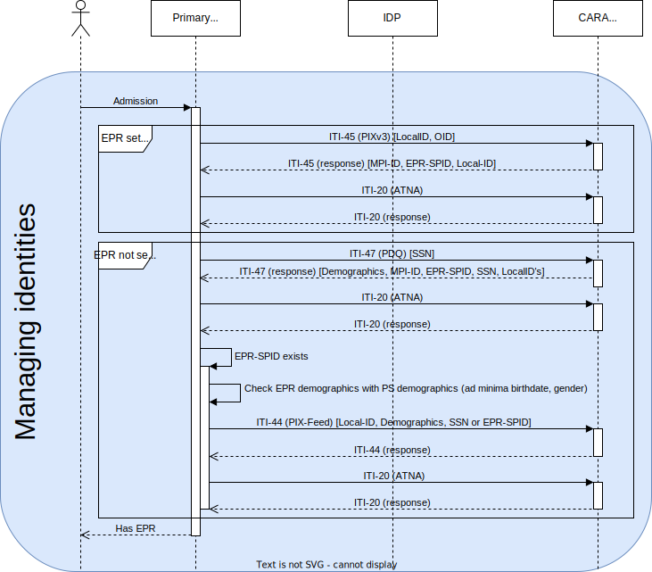
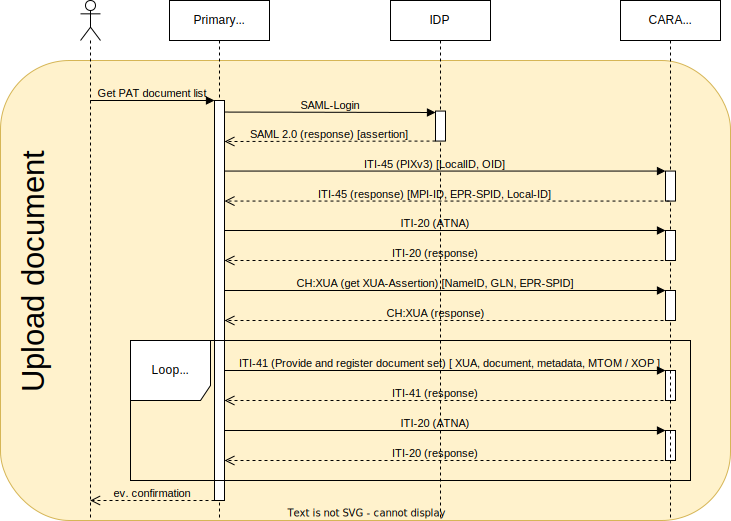

For a deep EPR integration into a primary systems the following usecases should be covered

1. Integrate the strong authentication into the primary system with an IdP (Level 1)
2. Search for patients in the community (Level 2.1)
3. Register a patient from the primary system in the community (Level 2.1)
4. Query and retrieve documents for a patient from the EPR including authorization (Level 2.2)
5. Publish documents for a patient by a healthcare professional (Level 2.2)
6. Providing AuditEvents (Level 2.1)
7. Query and update the Healthcare Professional Directory (HPD) (Level 2.3)
8. OID configuration

The levels of integration are described by eHealth Suisse, see
checklist [[fr]](https://selbstdeklaration.e-health-suisse.ch/upload/documents/Aide_mise_oeuvre_checkliste_anbindung_primaesystemen_F.pdf)
and [[de]](https://selbstdeklaration.e-health-suisse.ch/upload/documents/Umsetzungshilfe_Checklist_Anbindung_Primaersystemen.pdf).

eHealth Suisse has described the different steps with
examples [[fr]](https://www.e-health-suisse.ch/fr/technique-semantique/raccordement-dep/responsables-informatiques.html), [[de]](https://www.e-health-suisse.ch/technik-semantik/epd-anbindung/informatikverantwortliche.html).

You find test patients which you can use for publication of documents [here](testpatients.md).

Please find below additional information relevant for CARA and EPRIK:

## 1. Integrate the strong authentication into the primary system with and IdP

Authenticate a user at an identity provider certified for the Swiss EPR. Primary systems need to use this transaction to
retrieve a IdP assertion. The IdP assertion is required to retrieve the XUA Assertion to be used with EPR transactions.
See detailed description [here](https://github.com/ehealthsuisse/EPD-by-example/blob/main/files/AuthenticateUser.md).

See EPRIK example
for [AuthnRequest](https://test.ahdis.ch/eprik-cara/#/transaction/bd0e0019-53f1-4525-9bd2-3164ce79162c)
and [ArtifactResolve](https://test.ahdis.ch/eprik-cara/#/transaction/0d4c9995e29edd8b7475e4562534f7ad503ee4cc).

If you have a test user you can [use the IdP Assertion from EPRIK](usecases/#use-the-idp-assertion-from-eprik) until you
have done the IdP integration yourself.

## 2. Search for patients in the community

This sequence diagram shows the preferred way of managing patient identities.
The first case, *EPR set in PS* is the case where you have already linked your local patient identity to an EPR 
patient identity and fed your local identifier to the MPI.
To get the MPI-PID and the EPR-SPID, you just have to query the MPI with your local identifier (described in section 
3.2).

The second case, *EPR not set in PS*, is the case where you have to reconciliate the patient identities.
You can query the MPI for patient demographics (like name, birthdate, gender, etc., described in section 2.2) and 
manually match demographics.
Once that is done, you can feed your patient local identifier to the MPI (described in section 3.1).

### 2.1 Check if the patient has an EPR based on AHVN13/NAVS

With the PIX V3 query You can use AHVN13/NAVS13 to check if the patient has an EPR (EPR-SPID is returned), and if the
patient
is already registered in the community (MPI-PID is returned). See
example [request](https://test.ahdis.ch/eprik-cara/#/transaction/b7429b34-ffd5-4c57-a04a-702fab2f54b5) for patient
Gassmann, which returns EPR-SPID and MPI-PID in the id elements. For a test patient who has no EPR (as of 31.3.2023)
with AHVN13 7560739410295 no EPR-SPID and MPI-PID is returned,
see [request](https://test.ahdis.ch/eprik-cara/#/transaction/8a1323d4-3f0c-470d-89f6-d16126fd3dea). If the the AHVN13 is
not found, an Application Error (AE) will
be [returned](https://test.ahdis.ch/eprik-cara/index.html#/transaction/ccdc62d8-7451-49fe-99c3-846091713f41). For a test
patient who has an EPR but not in CARA int (as of 31.3.2023) with AHVN13 7560520619845 only EPR-SPID is returned,
see [request](https://test.ahdis.ch/eprik-cara/index.html#/transaction/ac000d64-e795-400c-8bcb-63a889a7bfc4).

### 2.2 Demographics Query

A search for a patient is done via a demographics query. See detailed
description [here](https://github.com/ehealthsuisse/EPD-by-example/blob/main/files/PDQ.md).

EPRIK example [request, response](https://test.ahdis.ch/eprik-cara/#/transaction/cd50db51-d218-4157-8848-d2b28be8ae67).
This example search is done on the family name, other demographics query parameters are possible. Please note that Swiss
Extension requires that an error is returned if more than 5 matched would be returned. You need to provide creationTime,
sender OID and receiver OID in addition to the query parameters in the request. For the communication you need a client
certificate but with EPRIK a client certificate is not necessary.

## 3. Register a patient from the primary system in the community and query the patient community id

### 3.1 Register local patient Id in the community

Register a patient in a community. Primary systems need to use this transaction to register patient data and then to be
able to provide and retrieve documents to the patients EPR. See detailed
description [here](https://github.com/ehealthsuisse/EPD-by-example/blob/main/files/PIXFeed.md).

EPRIK example [request, response](https://test.ahdis.ch/eprik-cara/#/transaction/a3e50707-6662-4fc4-a593-3ee7ea300c7c).
This example registers the local id from the primary system P003 of the patient identity domain 2.16.756.5.30.1.145.1.3
in the MPI. You need to provide creationTime, sender OID and receiver OID in addition to the patient parameters (
EPR-SPID, MPI-ID) in the request. For the communication you need a client certificate, but with EPRIK a client
certificate is not necessary.

### 3.2 Query MPI-PID and EPR-SPID based on local ID

The primary systems needs to query the master patient ID (MPI-ID) for patients to retrieve or provide documents for,
based on the local id registered above. See detailed
description [here](https://github.com/ehealthsuisse/EPD-by-example/blob/main/files/PIXQuery.md).

EPRIK example [request, response](https://test.ahdis.ch/eprik-cara/#/transaction/f9c72b8d-15d8-47df-81e1-cb38e082f6aa).

## 4. Query and retrieve documents for a patient from the EPR

This sequence diagram shows the search and retrieval of documents.
Searching documents in CARA is described in section 4.2a, searching in other communities is described in section 4.2b.
Retrieving a document is described in sections 4.3a and 4.3b, depending on the community.
The PIXv3 query is shown as a reminder.
For these calls, another mandatory step is the Get X-User Assertion call to get a XUA token from the EPR.

### 4.1 Authorization

To query and retrieve documents the HCP needs to be authorized based on the IdP token, the patient (resourceID with
EPR-SPID), purposeOfUse (NORM, EMER) and role (HCP).
See detailed description [here](https://github.com/ehealthsuisse/EPD-by-example/blob/main/files/GetXAssertion.md).

EPRIK
example [request, response](https://test.ahdis.ch/eprik-cara/index.html#/transaction/a6b31484-c1d4-4701-9f0d-58e837e9eab6).

Example STS requests with [IdP](requests/sts-eprik.http) or [EPRIK-httpheader](requests/sts-idp-httpheader-eprik.http).

### 4.2a Query documents from the CARA community

Retrieve the document metadata for the documents stored in a patients EPR for the CARA community. See detailed
description [here](https://github.com/ehealthsuisse/EPD-by-example/blob/main/files/RegistryStoredQuery.md).

EPRIK example [request, response](https://test.ahdis.ch/eprik-cara/#/transaction/3ece4177-ab0a-47ab-9431-6ebad553aa75).
For the Query the MPI-ID of the patient needs to be added. This example requests includes the security token necessary.
With the EPRIK you can do the user authentication there and reuse the
token [see](usecases/#use-the-idp-assertion-from-eprik). For the communication you need a client certificate but with
EPRIK a client certificate is not necessary.

### 4.2b Query documents from remote communities

To retrieve the document metadata for the documents stored in a patients EPR but registered in remote communities, the
initiating gateway has to be called with an IIT-18 query. EPRIK
example [request, response](https://test.ahdis.ch/eprik-cara/#/transaction/c2e8503a-97c6-4446-b233-155d57cf8e5e).
Gassmann has an example document in the remote community urn:oid:2.16.756.5.30.1.177.1.0.

### 4.3a Retrieve documents from the CARA community

To retrieve documents from a patients EPR the IHE XDS.b profile and transactions needs to be used. See detailed
description [here](https://github.com/ehealthsuisse/EPD-by-example/blob/main/files/RetrieveDocumentSet.md).

EPRIK example [request,response](https://test.ahdis.ch/eprik-cara/#/transaction/62065f91-91ec-4125-9dd8-aa8f3d90027a).
With EPRIK you can do the user authentication there and reuse the
token [see](usecases/#use-the-idp-assertion-from-eprik). For the communication you need a client certificate but with
EPRIK a client certificate is not necessary. You will need to add the HomeCommunityId, RepositoryUniqueId and
DocumentUniqueId.

### 4.3b Retrieve documents from remote communities

To retrieve the documents stored in remote communities, the initiating gateway has to be called with an ITI-43 query
with the homeCommunityId added from result 4.2b. EPRIK
example [request, response](https://test.ahdis.ch/eprik-cara/#/transaction/b5e221c3-7f83-4418-a53d-1bfbe3500ad5).

## 5. Publish documents for a patient by a healthcare professional

This sequence diagram shows the publication of a document by a healthcare professional.

To provide documents and metadata about the documents the IHE XDS.b profile and transactions needs to be used. See
detailed description [here](https://github.com/ehealthsuisse/EPD-by-example/blob/main/files/ProvideAndRegister.md).

EPRIK example [request,response](https://test.ahdis.ch/eprik-cara/#/transaction/5e770d0b-db8c-4fda-8ed5-8a2128a162c8).
With EPRIK you can do the user authentication there and reuse the
token [see](usecases/#use-the-idp-assertion-from-eprik). For the communication you need a client certificate but with
EPRIK a client certificate is not necessary. You will need to add metadata for the document.

### confidentiality code in metadata

The patient can set the default level of confidentiality to normally accessible , restricted accessible or secret. This
need to be taken into account when
publishing ([sequence diagram](https://ehealthsuisse.ihe-europe.net/docs/sequence_diagrams/2_03_EPR_HPStoreDocuments.plantuml.png)).
If a publication fails for normally accessible it has to be retried with restricted accessible. It is only possible to
publish a document with confidentiality secret if the user has set the default confidentiality code to secret. To test
this three different patients have been setup with different confidentiality codes: GASSMANN-IMHOLZ (normally
accessible, EPR-SPID: 761337613645876216), SOARES JESUS (restricted accessible, EPR-SPID 761337618424274719) et
Ratchawat (secret: EPR-SPID 761337611340275266)

| Publication with                     | normal | restricted | secret |
|--------------------------------------|--------|------------|--------|
| Gassmann (normally accessible)       | ok     | ok         | error  |
| SOARES JESUS (restricted accessible) | error  | ok         | error  |
| Ratchawat (secret)                   | error  | error      | ok     |

### metadata in portal

The portal displays the metadata provided in the publication. The patient name is only visible if it is provided in
PID-5
in [sourcePatientInfo](https://profiles.ihe.net/ITI/TF/Volume3/ch-4.2.html#4.2.3.2.23). [example](https://test.ahdis.ch/eprik-cara/#/transaction/e1159556-36e9-41c1-b9d4-740d21d0bf8b)

The institution can be filtered by the portal only if the `authorInstitution` contains an OID in the XON.10 field.

### provide a document with a technical user (TCU)

This sequence diagram shows the publication of a document by a technical user.

Instead of using an authenticated user for publishing documents, the ERP allows to publish documents with a technical
user [see factsheet in french](https://www.e-health-suisse.ch/fileadmin/user_upload/Dokumente/2019/F/fiche-dinformation-utilisateur-technique-dep.pdf).
You are required to create a client certificate for this technical user and let it register in the HPD. See
the [developer platform](https://developer.post.ch/en/e-health/basic-epr-workflows) for exact steps.

EPRIK allows you to work with a specific test technical user during integration. You can get the TCU IdP SAML2 assertion
from [here](https://test.ahdis.ch/eprik-cara/camel/tcu). This assertion is valid for 10 minutes. With this assertion you
can get then the XUA (STS) token for the XDS requests, for the urn:e-health-suisse:principal-id you need to put the GLN
to 2000040030829 when using EPRIK's technical user.
[example](https://test.ahdis.ch/eprik-cara/#/transaction/e1159556-36e9-41c1-b9d4-740d21d0bf8b)

### change metadata of existing documents (2.223)

If a document has been added the metadata can be changed with the IHE Restricted Metadata Update
Profile [(RMU)](https://www.ihe.net/uploadedFiles/Documents/ITI/IHE_ITI_Suppl_RMU.pdf). See an example message here,
where the document title
is [changed](https://test.ahdis.ch/eprik-cara/index.html#/transaction/d6e2b67b-8f0f-44ca-b7f0-36e56391922c). A new
ITI-18 query shows the
changed [title (Line 312)](https://test.ahdis.ch/eprik-cara/index.html#/transaction/6ab0d5fb-6c20-4ee1-ae83-d82fbbf1ec32).
If you are working with a Technical User you would need to store the DocumentEntry including entryUUID during the
provide and register transaction, because you cannot read it with ITI-18.

## 6. Providing AuditEvents

Each IHE Transaction has AuditEvent requirements.
This is described for each transaction (see example for
ITI-45 [here](https://github.com/ehealthsuisse/EPD-by-example/blob/main/files/PIXQuery.md#audit-log) or
in [eprik](https://test.ahdis.ch/eprik-cara/index.html#/transaction/02bc28f6-03b6-4d8b-ae7f-34a889267152)).
This AuditEvents need to be registered in the community.
With [EVSClient](https://ehealthsuisse.ihe-europe.net/evs/atna/validator.seam?standard=21) you can validate if the
content of the AuditMessages is correct.
See for sending message via syslog protocol also guidance about not using BOM
in [IHE 3.20.4.1.2 Message Semantics](https://profiles.ihe.net/ITI/TF/Volume2/ITI-20.html#3.20.4.1.2).

The specifications for generating the audit messages are given in the following documents:

1. [DICOM PS3.15 A.5](https://dicom.nema.org/medical/dicom/current/output/chtml/part15/sect_A.5.html): the
   foundation of audit messages.
2. [IHE profile for each transaction](https://profiles.ihe.net/ITI/TF/Volume2/index.html): in the section 'Security
   Considerations' of each transaction, you'll find IHE requirements.
3. [EPDV-EDI Annex 5 Complement 1](https://www.fedlex.admin.ch/eli/oc/2023/221/de/annexes): there are some Swiss
   requirements too. §1.5.2 describes generic requirements and §1.6.4.3.5.1 describes requirements for transactions
   that use a SAML assertion (XUA).

[EPD-by-example](https://github.com/ehealthsuisse/EPD-by-example) has some examples of audit messages.

## 7. Query and modify the Healthcare Professional Directory (HPD)

The HPD is an LDAP directory, and interactions with it are wrapped in DSMLv2 objects.
It contains three different objects: professionals (_ou=HCProfessional_), organizations (_ou=HCRegulatedOrganization_)
and relationship between them (_ou=Relationship_).

### 7.1 Query entries

With the [ITI-58](https://www.ihe.net/uploadedFiles/Documents/ITI/IHE_ITI_Suppl_HPD.pdf) transaction, you can query the
Healthcare Professional Directory (HPD) for the entries you are interested in.
You can query entries with LDAP filters on LDAP attributes and select the attributes to return.
[Example](https://test.ahdis.ch/eprik-cara/index.html#/transaction/50b2a089-cb39-45f6-90f3-16c3c98f8b74), [request](https://github.com/ahdis/epr-integration-cara/tree/main/docs/requests/iti-58-int-eprik.http).

### 7.2 Add an entry

With the [ITI-59](https://www.ihe.net/uploadedFiles/Documents/ITI/IHE_ITI_Suppl_HPD.pdf) transaction, you can add an
entry to the HPD with an _addRequest_.
[Example](https://test.ahdis.ch/eprik-cara/index.html#/transaction/301e8560-1a1a-4a0d-ad4c-622847eccf29), [request](https://github.com/ahdis/epr-integration-cara/tree/main/docs/requests/iti-59-int-add.http).

### 7.3 Modify an entry

With the [ITI-59](https://www.ihe.net/uploadedFiles/Documents/ITI/IHE_ITI_Suppl_HPD.pdf) transaction, you can update an
entry in the HPD with a _modifyRequest_.
[Example](https://test.ahdis.ch/eprik-cara/index.html#/transaction/705d8021-bb71-4c7c-bc5c-debf0245d630), [request](https://github.com/ahdis/epr-integration-cara/tree/main/docs/requests/iti-59-int-modify.http).

### 7.4 Delete an entry

With the [ITI-59](https://www.ihe.net/uploadedFiles/Documents/ITI/IHE_ITI_Suppl_HPD.pdf) transaction, you can delete an
entry from the HPD with a _delRequest_.
[Example](https://test.ahdis.ch/eprik-cara/index.html#/transaction/cc0597ef-dd71-41bd-809d-105883fa5af4), [request](https://github.com/ahdis/epr-integration-cara/tree/main/docs/requests/iti-59-int-delete.http).

## 8. OID Configuration

| Parameter                 | Integration                         | Production                         |
|---------------------------|-------------------------------------|------------------------------------|
| MPI OID Patient           | 2.16.756.5.30.1.191.1.0.2.1         | 2.16.756.5.30.1.191.3.0.2.1        |
| HL7 v3 Receiver Device ID | 2.16.756.5.30.1.191.1.0.12.1.101.2  | 2.16.756.5.30.1.191.3.0.12.1.101.2 |
| Repository unique ID      | 2.16.756.5.30.1.191.1.0.12.1.101.31 |                                    |
